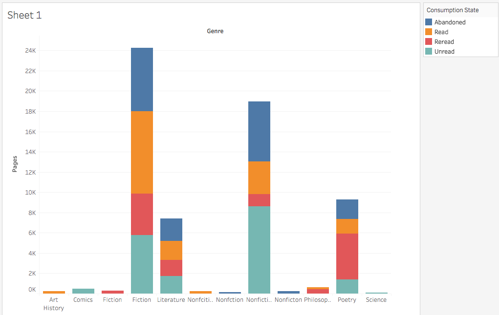

Moving from Cincinnati to New York ten years ago, I whittled a library of over 2,000 volumes down to about 400. During a recent fit of “Konmari” fever, my partner (Hasib) and I further purged our collection to 199. What do the surviving volumes say about us? What factors drive our decisions to read or not read, to keep or toss?

In addition to enlightening us as a book-buying pair, these visualizations might encourage others to investigate their own collections. They may even inform publishers and book sellers. For example, Barnes & Noble may want to know that I’m a sucker for buying and keeping giant science and history books that I will begin and then abandon.

I grouped my first three visualizations together because they spoke to what Hasib and I see at first glance: the titles of our books, who owns what, and what our books are for. A word cloud focuses on the frequency of the first words of our titles. Not surprisingly, “The” tops the chart, with “A” a close second. Ironically “Complete” and “Selected” tie (or vie) for third. Simple pie graphs reveal that I own the majority of our books, and we acquire books mostly for pleasure.

But, owning books and reading them are two very different things, and the next two visualizations reveal that we’ve only read or reread about half of what we’ve kept. The other half has been abandoned or never touched. The greatest number of unread pages are nonfiction, so perhaps we should rethink future purchases. A graph depicting books read and unread by publication date suggests that we don’t read many of our newer books (those published in the last decade), especially when they exceed 275 pages.

So, when every square inch of New York real estate matters, why keep so many books we haven’t read? Treemaps provide interesting insight. Looking at our motivations as part of a whole reveals that the greatest driving force for keeping a book is our love of it, which is true for about half of our collection. But the next greatest rationale is guilt: books we feel we should read but just haven’t. The next four greatest driving forces are all positive: love of the giver, the promise of the book, nostalgia, or the quality of the publication. Two books we keep on hand but can’t remember why; the same number we keep because we find them useful. Finally, we keep one book because we are good friends with the author and one merely for the sake of pretention. Dying to know which one we keep for pretention’s sake? The second treemap breaks our rationalized collection down by title, revealing a host of beloved books, pinpointing those we feel guilty about, and identifying Foucault’s _The History of Sexuality_ as our intellect candy. (Proust, Thucydides, and Beckett must be in storage.)

I was driven to the last visualization by one moving perk of my idiotic decision to collect this data by hand: I found items tucked in between the pages of some books. These hidden objects—whether placed intentionally or not—ground the eternal text in a specific moment in our lives. Like the inscriptions I wish I’d recorded (including one that read, “You’re weird too; you’ll like this.”), they make these books uniquely ours.

https://public.tableau.com/views/OurLibrary/Story1?:embed=y&:display\_count=yes&publish=yes&:origin=viz\_share\_link

The first dashboard is intended to be unencumbered by too great a focus on numbers. Both the word cloud (fitting for looking at the frequency of text) and the pie charts (despite their banality) clearly focus on proportional dominance. A quick glance reveals that “the” is the most frequent of our titles’ first words, that I own most of our books, and that the majority of our books were acquired for pleasure. The extremity of the pie chart on ownership reveals a significant limitation of this data set: it does not include digital reads. Hasib, who is dyslexic, is a voracious audiobook consumer of fiction, and I use my phone’s Kindle app for required school or work reading on my subway commute.

The treemap, with its visually dwindling frequency, yields an intriguing statement on the urges driving our decisions to keep books. (It’s prompted me to consider borrowing from the library books that I think I “should” read rather than purchasing them.) I couldn’t find a way to harness the power of the block labels while offering the granularity of individual titles, so I opted for two nearly identical treemaps to allow interested viewers to see which titles were kept for which reasons.

Finally, I couldn’t resist sharing the objects I found tucked into the pages. Like ejecta on the lunar surface, each seemed to say, “I was here.” Thanks to a little browsing of the “Show Me” pane in Tableau, I found the text table. But I wanted to add a layer that mimicked the hidden nature of these objects: hence, parenthetical tool tips connected to the title, author, and state of the book.

I should mention that the real lesson of this exercise for me was about structuring and cleaning data. During collection, cleaning, and visualizing, I would often find (usually many volumes in) an opportunity to provide greater or better detail that resulted in going back to the books themselves or restructuring the data to allow me to then create calculated fields. For example, it wasn’t until I entered the 43rd book that I realized that publication date might be useful. While I had listed items found in the pages in my “condition” field, I didn’t realize how they might be useful in their own field until later. Similarly, I didn’t figure out that noting the condition as a range of qualitative descriptors might not be terribly useful. (I did eventually convert them to a ordinal scale, but too late in the process to make good use of them.)

Another huge lesson was this: human data collection is fraught with potentially significant errors, but human analysis can help detect those errors. For example, typos are an obvious minefield. While typos in titles might not skew my data in significant ways, typos in genres certainly did. It took visualizing the data to see (and then fix) obvious errors.

\[caption id="attachment\_36" align="alignnone" width="1021"\] Note the many spellings of fiction and nonfiction.\[/caption\]

Because data collection took such a significant portion of my time, I feel as though I’ve only just scratched the surface of the questions answerable through visualization. There’s much I’d like to add to my data set: inscriptions, digital texts, estimated last-read date, location in our home, author gender and nationality. I’d also like to play with more visualizations even with the data I already have: author frequency, a correlation between pages and condition, a word cloud of all words in the titles. Of course, real fun would be to include data compiled by my friends, family, and colleagues. What texts have shaped us all? Where have we diverged as readers? What are we not exposing ourselves to that maybe we should? When and why do we turn to digital versions? To paraphrase Hamlet: questions, questions, questions.
